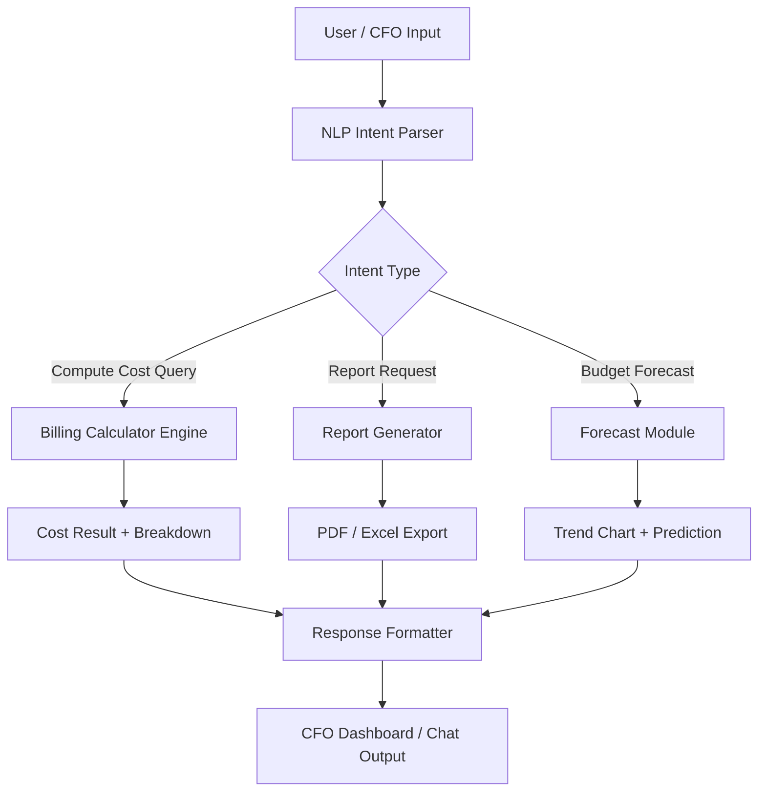

# CFO BOT — AI Implementation Plan

## Overview

**CFO BOT** is an intelligent financial assistant designed to automatically calculate the cost of computing resources, generate financial reports, and support the CFO in making management decisions based on resource consumption data.

**Core calculation formula:**
```
Cost = Compute Hours × Rate per Hour
Example: 100 hours × $0.05/hour = $5.00
```

---

## Proposed Architecture



---

## Proposed Changes

### Component 1: Core Billing Engine

#### [NEW] `billing_engine.py`
- Accepts input parameters: `compute_hours`, `rate_per_hour`, `resource_type`
- Implements `calculate_cost(hours, rate) → float` function
- Supports batch calculations for multiple resources
- Returns a structured `BillingResult` object with a cost breakdown

#### [NEW] `rate_config.yaml`
- Stores configurable rate settings by resource type
- Default value: `$0.05 / hour` (Compute Standard)
- Multi-currency support (USD / KZT / EUR)

---

### Component 2: NLP / Intent Layer

#### [NEW] `intent_parser.py`
- Recognizes queries like: *"How much does 100 compute hours cost?"*
- Extracts entities: hours, rate, period, resource type
- Returns a normalized `Intent` object with parameters

#### [NEW] `prompt_templates/billing_prompts.yaml`
- Templates for standard financial queries
- Few-shot example responses for model training

---

### Component 3: Report Generator

#### [NEW] `report_generator.py`
- Generates financial reports: daily, monthly, yearly
- Output formats: JSON, CSV, PDF (via `reportlab`), Excel (via `openpyxl`)
- Supports pivot tables grouped by resource type

---

### Component 4: API Layer

#### [NEW] `api/app.py` (FastAPI)
- `POST /calculate` — cost calculation
- `GET /rates` — retrieve current rates
- `POST /report` — generate a report
- `GET /health` — service health check

#### [NEW] `api/models.py`
- Pydantic models for request/response validation
- `ComputeRequest`, `BillingResult`, `ReportRequest`

---

### Component 5: Frontend / Dashboard

#### [NEW] `dashboard/index.html`
- CFO Dashboard web interface (HTML + CSS + JavaScript)
- Input panel for calculation parameters
- Cost visualization (Chart.js)
- Request history and report export

---

### Component 6: Tests

#### [NEW] `tests/test_billing_engine.py`
- Unit tests for all calculation scenarios (see Test Specifications)

#### [NEW] `tests/test_api.py`
- Integration tests for API endpoints

---

## Technology Stack

| Layer | Technology |
|---|---|
| Backend | Python 3.11, FastAPI |
| NLP | OpenAI GPT-4o / LangChain |
| DB | PostgreSQL + SQLAlchemy |
| Reports | reportlab, openpyxl |
| Frontend | HTML5, Vanilla CSS, Chart.js |
| Testing | pytest, httpx |
| Config | YAML, Pydantic Settings |
| Deploy | Docker + Docker Compose |

---

## Verification Plan

### Automated Tests
```bash
pytest tests/ -v --tb=short
pytest tests/test_billing_engine.py -v
pytest tests/test_api.py -v
```

### Manual Verification
- Start `uvicorn api.app:app --reload`
- Open `dashboard/index.html` in the browser
- Enter 100 hours → expected result: **$5.00**
- Verify report export to PDF and Excel
